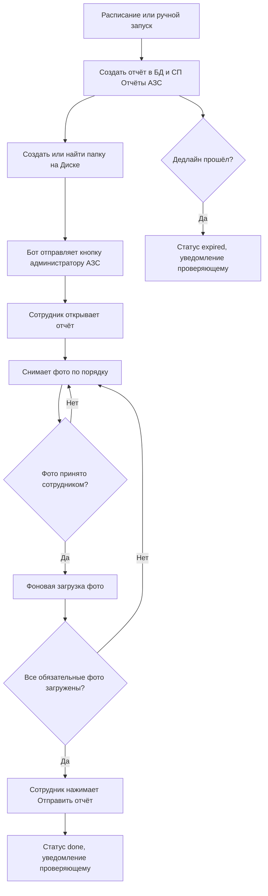

# 00. Обзор MVP

## Цель

MVP автоматизирует фото-контроль АЗС в Bitrix24: создаёт отчёты по расписанию или вручную, уведомляет администратора АЗС, принимает обязательные фото и показывает результат проверяющему.

## Стек

- Frontend: Nuxt.
- Backend: Node.js API.
- Storage: PostgreSQL для служебных таблиц и файловое JSON-хранилище настроек/OAuth-контекстов.
- Bitrix24: CRM smart processes, Disk, bot/IM, placements, OAuth REST.
- Публичный доступ для тестов: Cloudpub.

## Основные Модули

- `Settings`: выбор СП, полей, стадий, ролей и расписания.
- `Scheduler`: автоматический запуск отчётов по времени.
- `Reports`: создание, просмотр, загрузка фото, отправка и просрочка.
- `Disk`: создание папок и загрузка фото.
- `NotificationService`: бот `Порядок на АЗС` и fallback-уведомления.
- `Reviewer dashboard`: фильтры, ручной запуск, быстрые ссылки.
- `Auth`: per-user Bitrix24 OAuth context + JWT.

## Статусы Отчёта

- `new`: отчёт создан, сотрудник ещё не начал сдачу.
- `in_progress`: есть подтверждённые и загруженные фото.
- `done`: все обязательные фото загружены, сотрудник нажал отправку.
- `expired`: дедлайн прошёл, отчёт не был отправлен.
- `failed`: техническая ошибка создания/синхронизации, требует диагностики.

## Lifecycle

