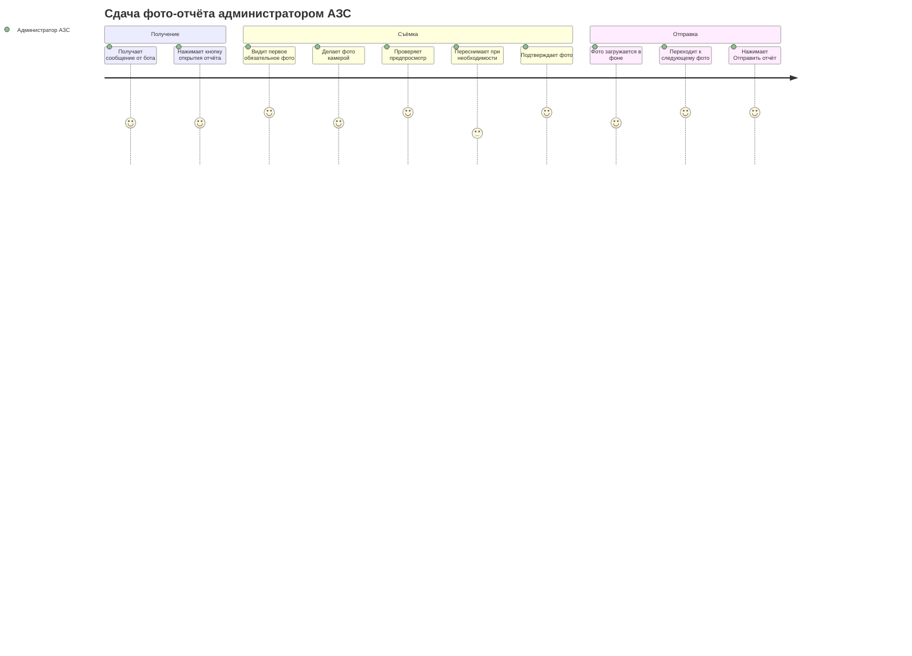
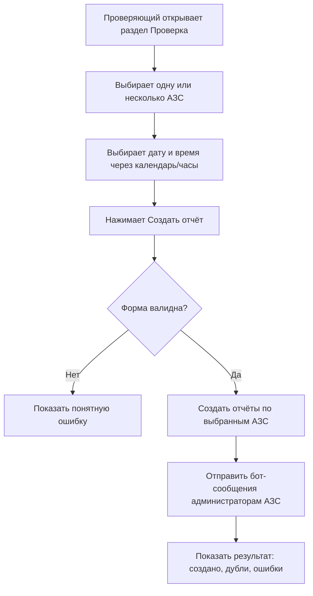

# 02. CJM И Пользовательские Сценарии

## Автоматический Отчёт По Расписанию

1. Администратор задаёт время отчётов в настройках.
2. Scheduler проверяет наступившие слоты.
3. Для активных АЗС создаются отчёты.
4. Для каждого отчёта создаётся папка на Диске.
5. Бот отправляет администратору АЗС кнопку открытия отчёта.
6. Если отчёт не отправлен до дедлайна, timeout watcher переводит его в `expired`.

## CJM Администратора АЗС

## Ручной Запуск Проверяющим

## Проверка Отчётов

Экран управляющего построен вокруг трёх вопросов: «как идёт сдача сегодня», «что произошло за день», «что я могу сделать прямо сейчас».

1. Управляющий открывает раздел «Проверка отчётов АЗС».
2. Сверху видит сводку периода: «Сдали отчёт N из M АЗС», цветной прогресс-бар и три чипа-фильтра (Сдан / В работе / Не сдан).
3. Переключает период одной кнопкой: Сегодня · Вчера · Неделя · Выбрать дату.
4. Под сводкой — лента событий за период: рассылка по расписанию, сдачи, просрочки, ручные запуски. Каждое событие со временем, иконкой и контекстом.
5. По событию «не сдан» сразу доступны действия — «Запросить повторно» и «Открыть фото».
6. В правой колонке управляющий настраивает расписание автоматической рассылки (времена, разброс, время на сдачу) без перехода в Настройки.
7. Там же — карточка «Запросить отчёт вне расписания»: выбрать АЗС → «Прямо сейчас» или «Запланировать» → «Отправить задание».
8. Технические детали отчётов (id, папка диска, карточка СП, ручная проверка просроченных) скрыты в раскрывающемся блоке внизу экрана.

## Просрочка

1. Timeout watcher регулярно ищет отчёты с `deadlineAt < now`.
2. Отчёты не в `done` и не в `expired` переводятся в `expired`.
3. Проверяющий получает уведомление.
4. В dashboard отчёт отображается как просроченный.
