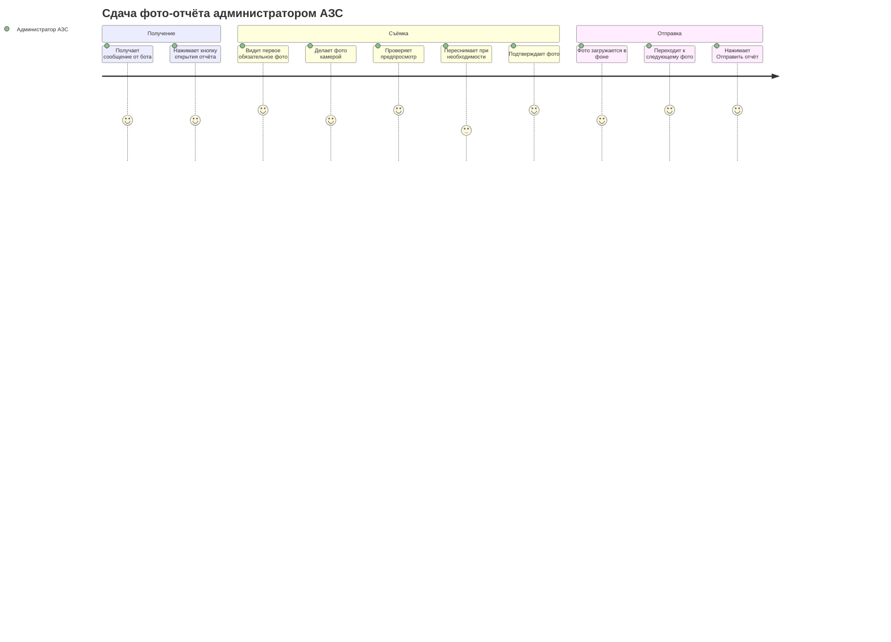
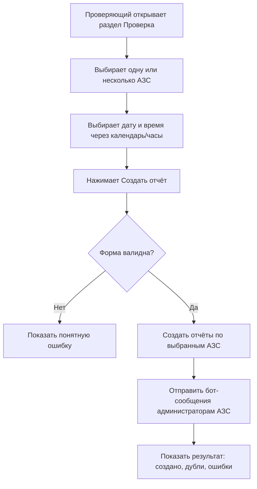

# 02. CJM И Пользовательские Сценарии

## Автоматический Отчёт По Расписанию

1. Администратор задаёт время отчётов в настройках.
2. Scheduler проверяет наступившие слоты.
3. Для активных АЗС создаются отчёты.
4. Для каждого отчёта создаётся папка на Диске.
5. Бот отправляет администратору АЗС кнопку открытия отчёта.
6. Если отчёт не отправлен до дедлайна, timeout watcher переводит его в `expired`.

## CJM Администратора АЗС

## Ручной Запуск Проверяющим

## Проверка Отчётов

1. Проверяющий открывает dashboard.
2. Фильтрует отчёты по дате, статусу и АЗС.
3. Видит АЗС, администратора, дедлайн, статус, количество фото.
4. Быстро переходит в карточку отчёта Bitrix24.
5. Быстро открывает папку с фото на Диске.
6. При необходимости запускает новый отчёт вручную.

## Просрочка

1. Timeout watcher регулярно ищет отчёты с `deadlineAt < now`.
2. Отчёты не в `done` и не в `expired` переводятся в `expired`.
3. Проверяющий получает уведомление.
4. В dashboard отчёт отображается как просроченный.
