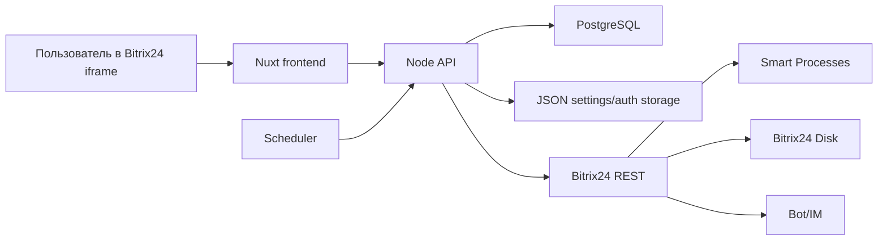

# 04. Архитектура

## Компоненты

## Frontend

Nuxt отвечает за:
- единый shell приложения;
- ролевую навигацию;
- настройки;
- dashboard проверяющего;
- экран сдачи отчёта;
- работу с камерой, предпросмотром и фоновыми загрузками.

Основные маршруты:
- `/`
- `/settings`
- `/reviewer`
- `/admin/[reportId]`
- `/handler`

## Backend

Node API отвечает за:
- JWT и Bitrix24 OAuth-контекст;
- настройки и роли;
- создание отчётов;
- загрузку фото;
- синхронизацию CRM/Disk;
- scheduler и timeout watcher;
- отправку bot/IM уведомлений.

## Auth

1. Bitrix24 iframe передаёт OAuth-данные в `/api/getToken`.
2. Backend проверяет токен через `profile` и `app.info`.
3. Контекст сохраняется по ключу `member_id:domain:user_id`.
4. Frontend получает JWT.
5. Все API-запросы идут с `Authorization: Bearer <JWT>`.
6. Middleware по JWT поднимает Bitrix24-контекст текущего пользователя.

Для cron используется последний валидный admin-контекст. Если его нет, scheduler пропускает тик и пишет диагностируемую ошибку.

## Данные

- Bitrix24 CRM хранит бизнес-сущности: АЗС, типы фото, отчёты.
- Bitrix24 Disk хранит фото.
- PostgreSQL хранит служебные данные приложения: идемпотентность запусков и статусы загруженных фото.
- JSON storage хранит настройки и OAuth-контексты.

## Уведомления

`NotificationService` поддерживает режимы:
- `bot`: основной режим, сообщения от `Порядок на АЗС`;
- `notify`: fallback через `im.notify.personal.add`.

## Scheduler

Scheduler читает настройки `report.dispatchTimes`, `dispatchJitterMinutes`, активные АЗС и создаёт отчёты идемпотентно. Timeout watcher переводит просроченные отчёты в `expired`.
